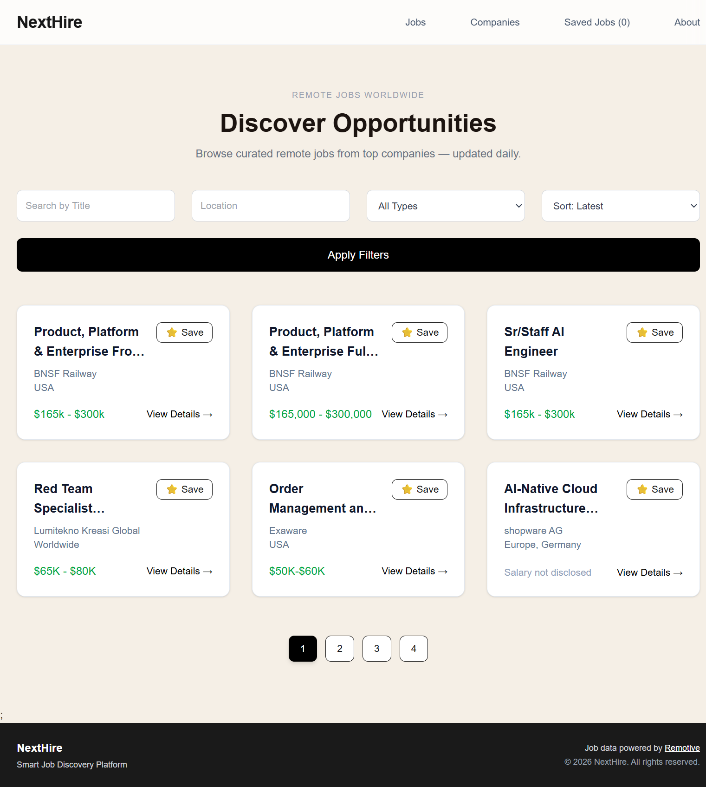
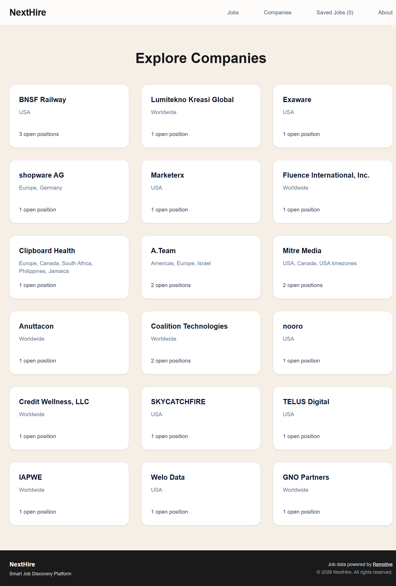
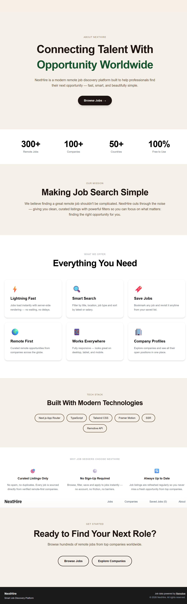

# 🚀 NextHire – Remote Job Discovery Platform

NextHire is a modern remote job discovery platform built with Next.js App Router.  
It allows users to browse, filter, and explore curated remote jobs from global companies — fast, simple, and beautifully designed.

🌍 *Live Demo:*  
👉 https://next-hire-16.vercel.app/

---

## ✨ Features

- 🔍 Smart job search (title, location, type)
- 📑 Filtering & sorting (latest, salary)
- 🔖 Save jobs (local storage powered)
- 🏢 Explore company profiles
- 🌎 Remote-first curated listings
- ⚡ Server-side rendering (SSR)
- 🎬 Smooth UI animations (Framer Motion)
- 📱 Fully responsive design
- 🔎 SEO optimized with metadata

---

## 🧠 Use Cases

- Remote job seekers
- Developers looking for global opportunities
- Recruiters exploring remote trends
- Portfolio showcase for Next.js App Router

---

## 🛠 Tech Stack

- *Next.js 16 (App Router)*
- *TypeScript*
- *Tailwind CSS*
- *Framer Motion*
- *Remotive API*
- *Vercel (Deployment)*

---

## 📸 Screenshots

### 🏠 Home Page


### 💼 Jobs Listing


### 🏢 Companies Page


### ℹ About Page


---

## ⚙ Installation & Setup

Clone the repository:

```bash
git clone https://github.com/loki-1612/next-hire.git
cd next-hire
